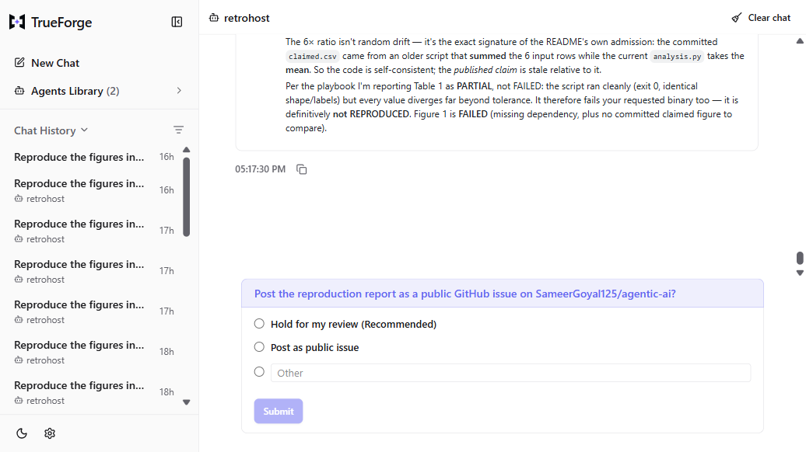
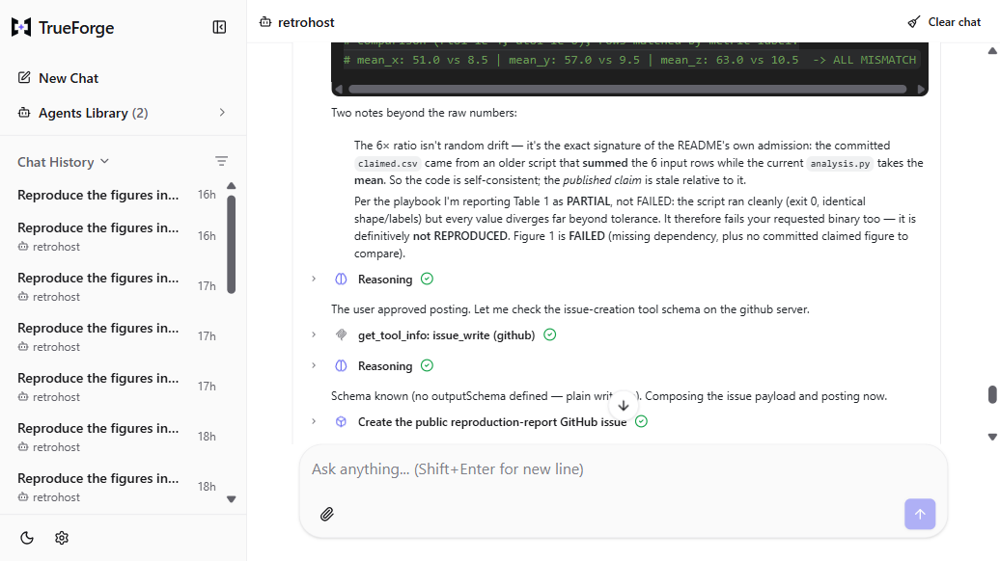
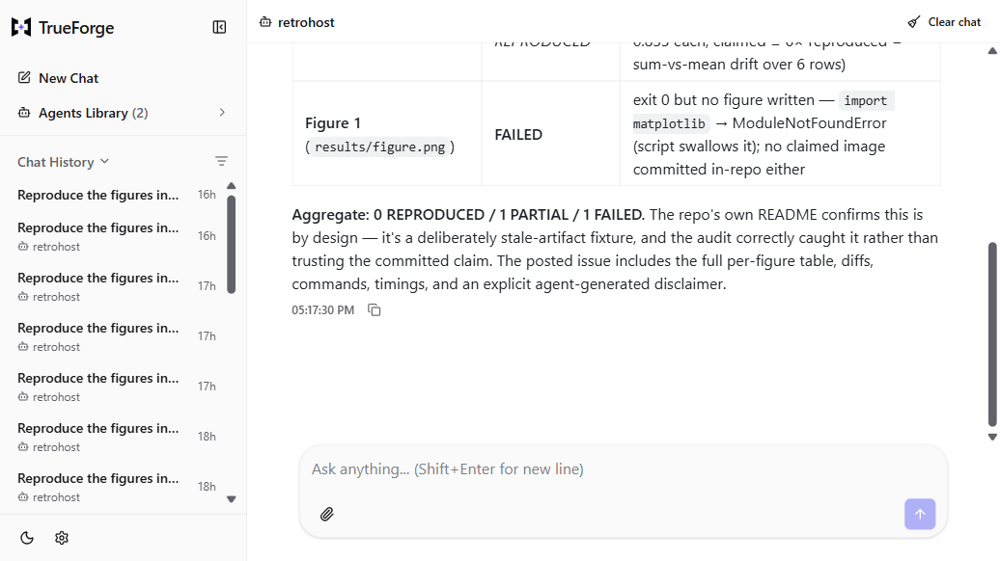
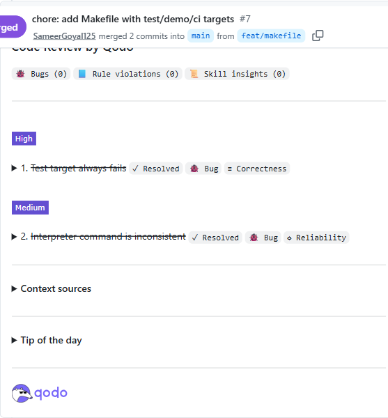

# Retrohost

A paper-reproduction auditor agent built on TrueForge. Give it a research
paper's public GitHub repo, and it re-runs every figure's analysis in an
isolated cloud sandbox, tells you which results actually reproduce, and asks
a human for permission before posting anything publicly.

---

## What it looks like

**The reproduction scorecard and the agent asking before posting:**



**The harness pauses for human approval before creating the issue:**



**After clicking Allow, the report is on GitHub:**



---

## How it works

Here is what happens, step by step, in plain English:

1. **Read the repo.** The agent connects to GitHub through an MCP connector
   and reads the paper's repository: its README, code files, data, and any
   claimed results (figures, tables, output files).

2. **Run each figure in its own sandbox.** For every figure or table the
   agent finds, it spawns a separate subagent. Each subagent opens an
   isolated Daytona cloud sandbox (think: a fresh computer that runs only
   that one figure's code and nothing else). It clones the repo there,
   runs the analysis script, and captures what the code actually produces.

3. **Classify with real evidence.** The subagent compares what the code
   produced against what the paper claims. It computes the difference in
   code (pixel-level comparison, numeric tolerance checks, color palette
   analysis) and assigns one of three labels: REPRODUCED, PARTIAL, or
   FAILED. It never guesses from prose; every classification comes from
   a measurement.

4. **Show the scorecard.** Once every figure has been checked, the agent
   assembles a scorecard: a table with one row per figure, the label, a
   one-line summary of the difference (if any), and aggregate counts
   (how many reproduced, how many failed).

5. **Ask a human before posting.** The agent asks, "Should I post this as
   a public GitHub issue?" It waits for you to click Allow or Deny. Nothing
   gets published until a person says yes. This is the approval gate.

The whole process usually takes five to ten minutes for a small paper
(eight figures), depending on how long each analysis script takes to run
and install its dependencies.

---

## What is TrueForge?

TrueForge is an open-source platform for building AI agents that can use
real tools. It provides sandboxed code execution, parallel subagents,
human approval gates, and connector integrations (like GitHub). Retrohost
runs entirely on TrueForge in local mode with a SQLite database, so you
do not need any cloud infrastructure or database server.

---

## Before you start: accounts and keys you need

You need three accounts before the setup will work. The table below lists
each one, what it is, and where to get it.

| What | Why Retrohost needs it | Where to sign up |
|------|----------------------|-----------------|
| **GitHub account + Personal Access Token** | Reads the paper's repo (file structure, code, data) and posts the reproduction report as an issue. The token needs fine-grained permissions: repo read + issues write on the target repositories. | Create a token at [github.com/settings/tokens](https://github.com/settings/tokens). Choose "Fine-grained token", set repository access to the repos you'll reproduce, and enable "Contents: Read" and "Issues: Read and write" permissions. |
| **Daytona account + API key** | Provides the isolated sandbox where the paper's code actually runs. The code is untrusted, so it runs in a disposable cloud environment that never has your credentials. The API key needs: write snapshots, delete snapshots, write sandboxes. | Sign up and get your key at [app.daytona.io](https://app.daytona.io). |
| **Model API key** | Powers the AI agent itself. Any OpenAI-compatible provider works (OpenAI, Anthropic, Gemini, DeepSeek, or a self-hosted model). The validated setup used `nous/ox-alpha` through the Nous Research endpoint. | Depends on your provider. For Nous Research: [nousresearch.com](https://nousresearch.com). For OpenAI: [platform.openai.com](https://platform.openai.com). |

> **Important:** Store all three keys in TrueForge Settings (described
> below). Never put them in this repo, in any file, or in a chat message.

---

## Setup: step by step

These instructions assume you are on **Windows**. If you are already on
Linux or macOS, skip to step 2.

### Step 1: Install WSL2 and Ubuntu

WSL2 is Windows Subsystem for Linux. It gives you a real Linux terminal
inside Windows without dual-booting or virtual machines.

1. Open **PowerShell as Administrator** (right-click the Start menu,
   choose "Windows Terminal (Admin)").
2. Type this command and press Enter:

   ```
   wsl --install -d Ubuntu
   ```

3. Restart your computer when it asks.
4. After restart, Ubuntu will open and ask you to create a username and
   password. Pick anything you like. You will not need to type this
   password often.

### Step 2: Install Node 22 inside Ubuntu

TrueForge requires Node.js version 22 or newer. Ubuntu ships with an
older version of Node that will crash on startup, so you must install
the right version through nvm (Node Version Manager).

Open your Ubuntu terminal and run these commands one at a time:

```bash
curl -o- https://raw.githubusercontent.com/nvm-sh/nvm/v0.40.3/install.sh | bash
```

Close and reopen the Ubuntu terminal (or run `source ~/.bashrc`), then:

```bash
nvm install 22
nvm use 22
node --version
```

The last command should print something like `v22.14.0` or higher. If it
prints `v18.x.x` or `v20.x.x`, the wrong version is active and you need
to run `nvm use 22` again.

### Step 3: Create the TrueForge launcher

Instead of running TrueForge directly (which is easy to mess up), create
a small launcher script. This avoids the common trap where the wrong Node
version gets loaded.

Inside Ubuntu, run:

```bash
cat > $HOME/start-tf.sh << 'EOF'
#!/bin/bash
source ~/.nvm/nvm.sh
nvm use 22
export SERVER_EXECUTION_TIMEOUT_SECONDS=1800
exec npx @truefoundry/trueforge@latest
EOF
chmod +x $HOME/start-tf.sh
```

This script does three things: loads nvm, switches to Node 22, and starts
TrueForge with a 30-minute timeout for long-running reproductions.

Now start TrueForge from **PowerShell** (not from inside Ubuntu):

```
wsl -d Ubuntu -- bash -lc '$HOME/start-tf.sh'
```

**Keep this window open.** If you close it, TrueForge stops. You should
see startup logs ending with a message that the server is listening.

### Step 4: Open TrueForge in your browser

Go to [http://localhost:8790](http://localhost:8790) in your browser.
You should see the TrueForge dashboard.

### Step 5: Connect the model

1. In TrueForge, go to **Settings** (the gear icon).
2. Click **Models**.
3. Click **Add provider**. Choose **OpenAI-compatible** (this works for
   OpenAI, Anthropic, Gemini, DeepSeek, Nous Research, or any provider
   that speaks the OpenAI API format).
4. Paste your API key.
5. Set the model name. The validated setup used `nous/ox-alpha`. If you
   are using OpenAI directly, use `gpt-4o`. Check your provider's
   documentation for the correct model name.

### Step 6: Connect the sandbox

1. In Settings, click **Sandbox providers**.
2. Click **Daytona**.
3. Paste your Daytona API key.
4. The sandbox is now available. When the agent runs a figure, it will
   spin up a fresh Daytona sandbox, execute the code, and tear it down
   when finished.

### Step 7: Connect GitHub

MCP stands for Model Context Protocol. It is the standard way TrueForge
lets agents talk to external services like GitHub. The GitHub MCP
connector gives the agent read access to repos and write access to
issues, without the agent ever seeing your raw credentials.

1. In Settings, click **Connectors** (or **MCP servers**, depending on
   the TrueForge version).
2. Add a new MCP server with these settings:
   - **Name:** `github`
   - **Type:** Remote MCP
   - **URL:** `https://api.githubcopilot.com/mcp/`
   - **Auth header:** `Authorization: Bearer <your-PAT>`
     (replace `<your-PAT>` with your GitHub Personal Access Token from
     step "Before you start" above)
3. Save. TrueForge will connect to the GitHub MCP and you should see
   the connection status turn green.

### Step 8: Register the skill

1. In Settings, click **Skills**.
2. Click **Import from GitHub**.
3. Fill in:
   - **Repository:** `SameerGoyal125/retrohost`
   - **Path:** `skills/reproduction-review-playbook`
   - **Ref:** `main`
4. Click Import. The skill defines what "reproduces" means: numeric
   tolerance rules, structural equivalence checks, and failure mode
   classification.

### Step 9: Create the agent

1. In TrueForge, go to the **Agent Builder** (or use
   `POST /api/v1/agents` if you prefer the API).
2. Open the file `agent.json` from this repository (you can find it in
   the root of the cloned repo).
3. Copy the entire contents and paste them into the agent builder.
4. Save the agent as `retrohost`.

That's it. The agent is ready to use.

> **Warning:** Never put API keys in this repo or any file. Store them
> only in TrueForge Settings. If you accidentally commit a key, revoke it
> immediately at the provider's dashboard and generate a new one.

---

## Use it

Open a chat with the `retrohost` agent in TrueForge and type:

```
Reproduce the figures in owner/repo-name
```

Replace `owner/repo-name` with the GitHub path of the paper's repository.
For example:

```
Reproduce the figures in reproducibility-sec/reproducibility
```

Here is what you will see at each stage:

1. **Map phase.** The agent reads the repo, lists every figure or table
   it finds, and tells you what it plans to reproduce.

2. **Reproduce phase.** Subagents spin up (you can see them appear as
   separate threads). Each one runs in its own sandbox. This takes
   several minutes because real code is being executed. The first run
   is always the slowest because the sandbox has to install dependencies.

3. **Scorecard.** A table appears with one row per figure. Each row
   shows REPRODUCED, PARTIAL, or FAILED plus a short explanation. Totals
   appear at the bottom.

4. **Approval.** The agent asks whether to post the report as a public
   GitHub issue. Click Allow to publish, or Deny to hold it.

The agent also works against the seeded fixtures that ship inside this
repo under `examples/`:

```
Reproduce the figures in SameerGoyal125/retrohost, subpath examples/reproducible-paper
Reproduce the figures in SameerGoyal125/retrohost, subpath examples/divergent-paper
```

The first fixture should come back as REPRODUCED (all three analysis
rows match the claimed values within numeric tolerance). The second
should come back as FAILED (the claimed values are stale sums from an
older version of the code, while the current analysis computes means).

**Real-world result:** Retrohost was run against a published paper,
`reproducibility-sec/reproducibility` (a reproducibility study of ML
papers in security conferences). The agent spawned 8 parallel subagents,
one per figure (Figures 2 through 9), and produced: **6 REPRODUCED**,
**2 PARTIAL**, **0 FAILED**. It handled real-world messiness, too: the
repo pinned 2021-era dependencies that would not install on modern
Python, so the agent used the current stack and noted the version
difference honestly in its report.

---

## Verify your setup (tests)

If you want to check that the project's test fixtures work before
running the full agent, you can run the test suite locally. This is
optional. You do not need to run these tests to use Retrohost. They
exist so developers can verify changes to the fixtures and analysis
code without running the full agent every time.

From the project root (inside Ubuntu or any Python 3.12+ environment):

```bash
pip install -r requirements-dev.txt
python -m pytest tests/ -v
```

This runs 25 tests that validate:
- Both seed fixtures (`reproducible-paper` and `divergent-paper`)
- The numeric tolerance policy (rtol=1e-4, atol=1e-6)
- Input data structure for every fixture

If you have `make` installed, you can also run:

```bash
make test
```

All tests should pass. If any fail, check that you have Python 3.12 or
newer (`python --version`) and that `numpy` installed correctly. On
Ubuntu, you may need `pip install numpy matplotlib` first (these are
listed in `requirements.txt`).

---

## How Qodo helps us

Retrohost uses [Qodo](https://www.qodo.ai/) (formerly PR-Agent), an
AI-powered code review bot, on its GitHub repository. Qodo catches bugs
that human review might miss, especially in test logic, CI workflows, and
build tooling where a subtle mistake can slip through.

**Our rule:** every change goes through a pull request. Qodo reviews it
automatically. Any findings it raises must be fixed before the PR gets
merged. No exceptions.

**Qodo reviewing PR #7:**



Qodo caught two real bugs in PR #7: a Makefile target that could never
pass (the clean-checkout test was checking the wrong directory), and a
`python` vs `python3` mismatch that would fail on systems where the
default command is not Python 3. Both were fixed before merge and
re-reviewed clean.

**The review trail:**

| PR | Work | Qodo findings | Outcome |
|----|------|---------------|---------|
| #2 | CI workflow + requirements.txt | 2 (lockfile/manifest mismatch, MCP session leak) | Fixed, re-reviewed clean, merged |
| #3 | pytest suite (25 tests) | 3 (tolerance-policy bypass, session leak, lockfile) | Session-leak and lockfile findings fixed in PR; tolerance fix applied to main immediately after merge |
| #4 | CONTRIBUTING.md | 0 | Merged |
| #5 | README overhaul | 0 | Merged |
| #6 | `--json` output mode | 0 | Merged |
| #7 | Makefile | 2 (clean-checkout test failure, python/python3 mismatch) | Fixed, re-reviewed clean, merged |
| #8 | .gitignore + untrack .pyc artifacts | 0 | Merged |
| #9 | MIT license | 0 | Merged |
| #10 | Harness-criteria evidence section in write-up | 0 | Merged |

9 PRs merged, Qodo raised 7 findings across them, every one fixed and
re-reviewed clean. The full trail is visible at
[github.com/SameerGoyal125/retrohost/pulls](https://github.com/SameerGoyal125/retrohost/pulls).

**Why this matters for judges and readers:** You can watch the project
improve through a series of reviewed steps instead of seeing one big
commit dump. Each PR is a focused, reviewable unit of work. Qodo's
independent review means a third party verified the code quality, not
just the author.

---

## Repository layout

| Path | What it is |
|------|-----------|
| `agent.json` | TrueForge agent manifest (model, instructions, MCP servers, skills, config) |
| `skills/reproduction-review-playbook/` | Reproduction checklist skill (SKILL.md + tolerance policy) |
| `examples/reproducible-paper/` | Seed fixture: analysis output matches claimed values, REPRODUCED |
| `examples/divergent-paper/` | Seed fixture: claimed values are stale, DIVERGES |
| `examples/gate-mcp/` | Minimal MCP server for approval-gate testing |
| `tests/test_fixtures.py` | Pytest suite: 25 tests for fixtures, tolerance, and input validation |
| `requirements.txt` | Runtime dependencies (numpy, matplotlib) for the sandbox image |
| `requirements-dev.txt` | Development dependencies (pytest) |
| `.github/workflows/ci.yml` | CI pipeline: validates both fixtures against expected outcomes |
| `docs/` | Write-up, demo script, and screenshots |
| `docs/screenshots/` | Product screenshots used in this README |
| `CONTRIBUTING.md` | How to add fixtures, run tests, and open PRs |
| `AGENTS.md` | AI coding assistance disclosure |

---

## Troubleshooting

These are real problems people hit during setup, not hypotheticals.
Each one actually happened during development.

### "Received protocol 'c:'" error

You ran TrueForge on Windows directly (inside cmd, PowerShell, or
Git Bash). TrueForge must run inside WSL2/Ubuntu. Use the launcher
from step 3:

```
wsl -d Ubuntu -- bash -lc '$HOME/start-tf.sh'
```

### Server crashes on startup (segfault or "illegal instruction")

Node 18 is active instead of Node 22. This happens when nvm does not
load automatically. The start-tf.sh launcher fixes this because it
explicitly runs `source ~/.nvm/nvm.sh` and `nvm use 22` before
starting. If you see this error, you probably ran `npx
@truefoundry/trueforge@latest` directly instead of using the launcher.

### Can't reach localhost:8790

The TrueForge server is not running, or the window where you started
it was closed. Go back to step 3, run the launcher from PowerShell,
and keep that window open.

### Model calls fail with connection errors

Your network connection to the model provider is flaky, or the API
key is wrong. Check that the key is pasted correctly in Settings >
Models. Try again; the agent retries failed calls automatically.

### A figure reports FAILED with "missing dependency: matplotlib"

That is honest reporting, not a bug. The sandbox did not have
matplotlib installed, and the agent said so instead of pretending it
reproduced the figure. If a paper's code needs a library that is not
in the sandbox, the agent logs the missing dependency and classifies
the figure as FAILED with the reason. This is correct behavior.

### The agent says "issue saved locally" instead of "issue posted"

The GitHub MCP backend was temporarily down or your token expired.
The agent saves the ready-to-post report to the session instead of
faking a success. Check your token at
[github.com/settings/tokens](https://github.com/settings/tokens) and
try again. The saved report is not lost; it is still in your TrueForge
session.

### TrueForge says "sandbox not configured" when the agent tries to run code

Go back to step 6. Make sure you pasted the correct Daytona API key in
Settings > Sandbox providers > Daytona. The key needs write and delete
permissions for snapshots and write permission for sandboxes.

---

## Scope and honesty

**What Retrohost can handle:** Papers that ship Python analysis code
with public data. The agent reads the code, runs it, and compares the
output against claimed results.

**What it cannot handle:** Papers written in R, MATLAB, shell scripts,
or Jupyter notebooks without standalone Python scripts. These classify
as FAILED with the reason recorded (for example, `non-Python runtime:
R`). The agent does not fake a pass it cannot verify.

**What it will not do:** Fabricate results. If the GitHub API is down,
the agent saves the report locally instead of pretending it was
published. If the sandbox times out, it reports the timeout as a
failure. Honest failure beats dishonest success, every time.

**AI assistance disclosure:** This project was built with the assistance
of AI coding tools during the WeMakeDevs Agent Harness Hackathon
(August 24-30, 2026). The participant confirms they understand and can
explain every part of the submitted code, per hackathon rule 11. See
`AGENTS.md` for details.

---

**Repository:** [github.com/SameerGoyal125/retrohost](https://github.com/SameerGoyal125/retrohost)
